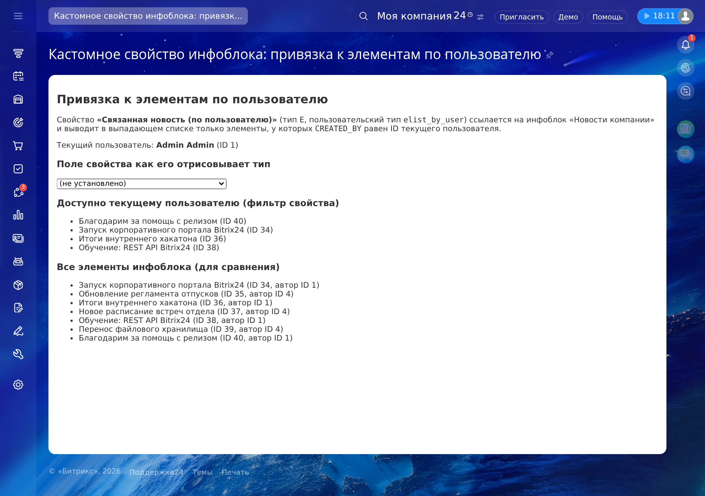

# Bitrix24: кастомное свойство инфоблока «Привязка к элементам по пользователю»

Репозиторий-пример, как создавать **собственные типы свойств инфоблока** в Битрикс24. В комплекте один готовый тип — `elist_by_user`: выпадающий список элементов связанного инфоблока, как у штатной «Привязки к элементам», но список **фильтруется по текущему пользователю**: по умолчанию показываются только элементы, созданные им (`CREATED_BY`).

## Пример отображения



Одно и то же свойство под разными пользователями: админ видит только свои новости, обычный сотрудник — только свои.

## Как это устроено

Кастомный тип свойства — это класс со статическими методами по контракту Битрикса + регистрация в событии `OnIBlockPropertyBuildList`:

| Файл | Назначение |
|------|------------|
| `local/php_interface/lib/IBlockProperty/EListByUser.php` | Класс типа `elist_by_user` (контракт `GetPropertyFieldHtml`, `GetSettingsHTML`, `GetUIFilterProperty` и др.) |
| `local/php_interface/lib/IBlockProperty/lang/ru/EListByUser.php` | Языковые сообщения (ключи `MTAI_ELIST_BY_USER_*`) |
| `local/php_interface/autoload.php` | Автозагрузка класса |
| `local/php_interface/event_handler.php` | Регистрация типа: `OnIBlockPropertyBuildList` → `EListByUser::GetUserTypeDescription()` |
| `iblock_property/index.php` | Демо-страница: живой селект свойства и сравнение «все элементы / доступные вам» |

### Настройки свойства

Задаются в форме редактирования свойства (как у штатной привязки к элементам) плюс одна новая:

- **Поле для фильтрации по ID пользователя** — поле связанного инфоблока, по которому фильтруется список. По умолчанию `CREATED_BY` (показывать элементы, созданные текущим пользователем); можно указать `MODIFIED_BY` или `PROPERTY_<код свойства>` для фильтра по пользовательскому свойству связанного инфоблока.

Остальные настройки: высота и ширина списка, группировка по разделам (`optgroup`), множественный выбор.

### Что внутри класса

Тип наследует поведение штатного `CIBlockPropertyElementList`, отличие — в источнике элементов: `GetElements()` добавляет к фильтру выборки условие `«<поле> = ID текущего пользователя»` (`CurrentUser::get()->getId()`). Отсюда автоматически фильтруются:

- поле в форме редактирования элемента (админка и публичная форма);
- фильтр в админ-списке и UI-гридах (`GetAdminFilterHTML`, `GetUIFilterProperty`);
- редактор сущностей (CRM и т.п.) через `GetUIEntityEditorProperty`.

## Установка

1. Скопируйте каталог `local/` в корень портала.
2. Убедитесь, что в `local/php_interface/init.php` подключены автозагрузчик и обработчик события:

   ```php
   require dirname(__FILE__) . '/autoload.php';
   require dirname(__FILE__) . '/event_handler.php';
   ```

3. В настройках инфоблока создайте свойство: тип «Привязка к элементам по пользователю», укажите связанный инфоблок и при необходимости поле фильтрации.

## Как добавить свой тип свойства (чек-лист)

1. Класс с методом `GetUserTypeDescription(): array` — описывает `USER_TYPE_ID`, `PROPERTY_TYPE` (`S`/`N`/`E`/`L`/`F`) и колбэки рендера/настроек.
2. Обработчик события `iblock::OnIBlockPropertyBuildList`.
3. Автозагрузка класса через `Loader::registerAutoLoadClasses()`.
4. Языковой файл рядом с классом: `lib/.../lang/ru/<Класс>.php` (для неймспейс-классов `Loc::loadMessages(__FILE__)` ищет его именно там).
5. При наследовании штатного типа скопируйте только нужные методы — контракт вызывается ядром по имени.

## Технологии

- PHP 7.4+
- Битрикс24 / Битрикс: Управление сайтом (модуль `iblock`)
- `CIBlockElement::GetList`, `CIBlockSection::GetList`, `Bitrix\Main\Engine\CurrentUser`
